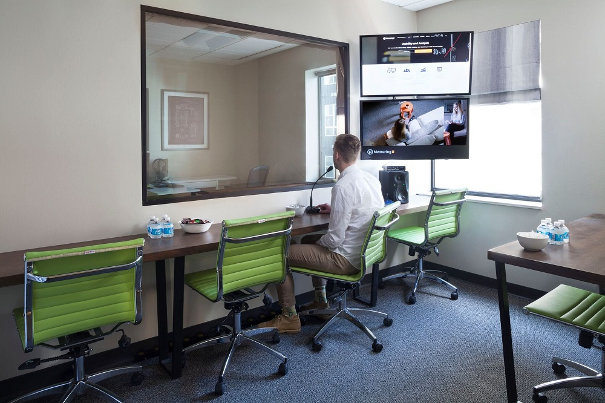

# Lab Usability Testing

<figure><figcaption>
Image by <a href="https://measuringu.com/build-usability-lab/">MeasuringU</a>
</figcaption></figure>

Lab usability testing is a structured research method where a participant is invited into a controlled environment, such as a dedicated observation room, to complete specific tasks using a product. While a researcher sits with the participant to facilitate the session, other team members often watch the live feed from behind a one way mirror or via a video link. This setup allows the design team to observe a user's behaviour, facial expressions, and frustrations in great detail without any outside distractions or interruptions.

The primary goal of this approach is to gather high quality, in depth data about how a person navigates an interface. Because the environment is controlled, the researcher can use high quality recording equipment to capture every mouse movement and every word the participant says. This makes it much easier to identify complex usability issues that might be missed in a more casual setting. It is particularly useful for testing sensitive prototypes or products that require a high level of security and concentration from the user.

Although lab testing can be more expensive and time consuming than other methods, the level of insight it provides is often unmatched. It allows for a deep dive into the "why" behind user actions, as the moderator can ask follow up questions at the perfect moment. By bringing stakeholders into the observation room to see real people struggle or succeed with the design, it creates a powerful shared understanding of what needs to be fixed before the product is launched.

#### Further Reading





