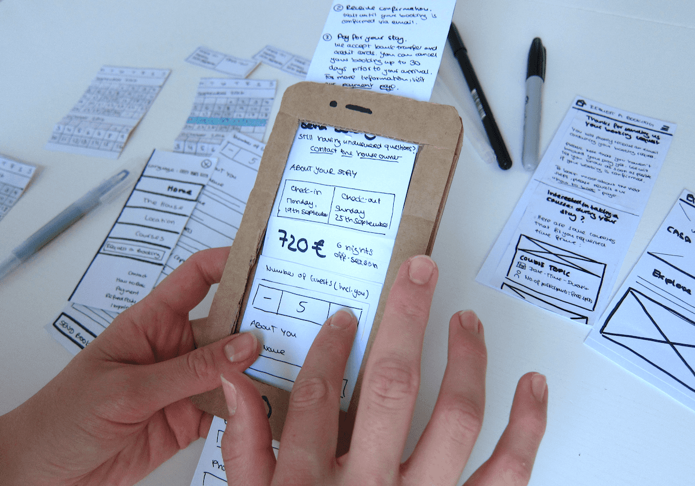

# Prototype Testing

<figure><figcaption>
Image by <a href="https://martha-eierdanz.com/">Martha Eierdanz</a>
</figcaption></figure>

Prototype testing is the practice of sharing a preliminary version of a design with real people to see how they interact with it before the final product is built. By using a simplified model, such as a clickable series of screens or a paper mockup, you can observe where users get stuck or confused. This method allows you to identify flaws in the navigation or layout early on, which is much cheaper and faster than trying to fix those same issues once the software has been fully coded.

During a testing session, you typically give a participant a specific task to complete while you watch and listen to their feedback. The focus is not on whether the user is "correct" but on whether the design is intuitive enough to guide them to their goal. These insights help the team understand if the current direction is working or if they need to rethink certain features. It is a vital step for refining the user experience because it replaces assumptions with actual evidence of human behaviour.

Ultimately, prototype testing reduces the risk of launching a product that fails to meet user needs. It creates a feedback loop where you can quickly make changes, test them again, and ensure the final result is polished and effective. This process gives the entire team more confidence that the design will succeed in the real world because it has already been proven to work in a controlled setting.

#### Further Reading



















#### Further Viewing












